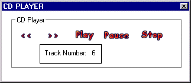



## CD Player \- By motti Horesh

### Description

This is an example how to use the   control "Microsoft Multimedia Control 6.0", this  program is pre-program for a media player that i  am working on. and it very neat and easy use  control, the only problem with it that you only  can play *.wav and CD's 

 

please report on any bugs!!! 
 
### More Info
 

             |
---                |---
**Submitted On**   |2001-04-09 18:46:16
**By**             |[Motti Horesh](https://github.com/Planet-Source-Code/PSCIndex/blob/master/ByAuthor/motti-horesh.md)
**Level**          |Beginner
**User Rating**    |4.0 (16 globes from 4 users)
**Compatibility**  |VB 6\.0
**Category**       |[Sound/MP3](https://github.com/Planet-Source-Code/PSCIndex/blob/master/ByCategory/sound-mp3__1-45.md)
**World**          |[Visual Basic](https://github.com/Planet-Source-Code/PSCIndex/blob/master/ByWorld/visual-basic.md)
**Archive File**   |[CD Player 18144492001\.zip](https://github.com/Planet-Source-Code/motti-horesh-cd-player-by-motti-horesh__1-22260/archive/master.zip)

